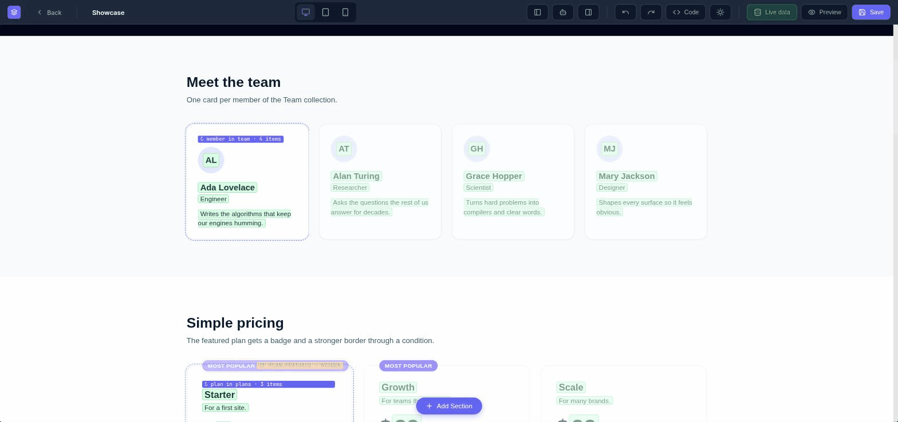
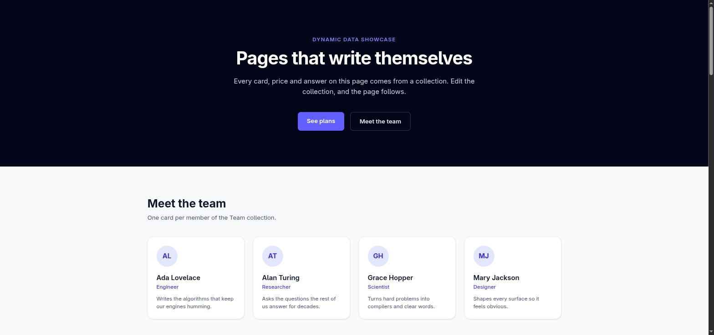
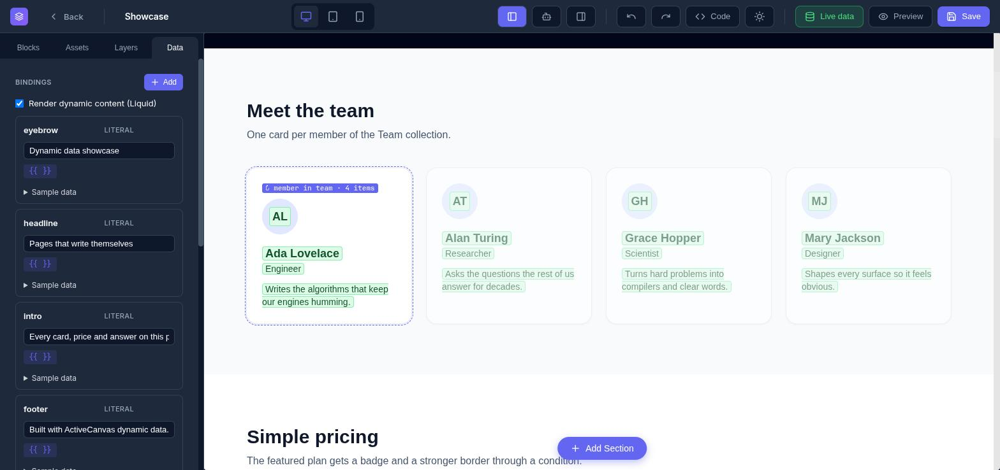
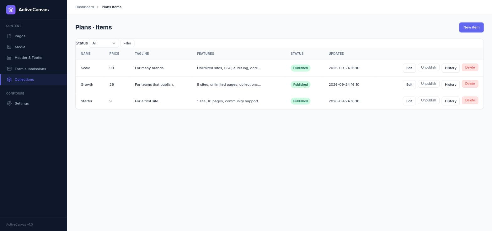
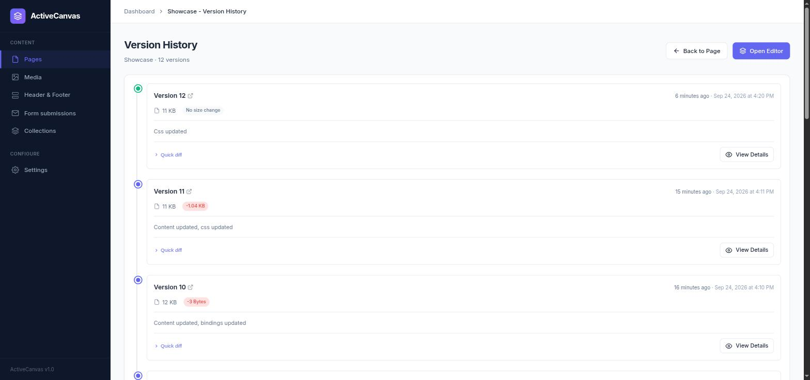

# ActiveCanvas



*The Live data switch: every chip shows the value it renders, loops show every item, conditions dim what they hide. Switch it off to see the Liquid source. The saved page always keeps the source.*

A mountable Rails engine that turns any Rails app into a full-featured CMS. Includes a visual drag-and-drop editor (GrapesJS), AI-powered content generation, Tailwind CSS compilation, media management, page versioning, and SEO controls -- all behind an admin interface that works out of the box.

## Features

- **Visual Editor** -- Drag-and-drop page builder powered by GrapesJS
- **AI Content Generation** -- Text, images, and screenshot-to-code via OpenAI, Anthropic, or OpenRouter
- **Tailwind CSS Compilation** -- Per-page compiled CSS for production (no CDN dependency)
- **Media Library** -- Upload and manage images/files with Active Storage
- **Page Versioning** -- Automatic version history with diffs and rollback
- **Header & Footer Partials** -- Reusable components, togglable per page
- **SEO** -- Meta tags, Open Graph, Twitter Cards, JSON-LD structured data
- **Page Types** -- Categorize pages (blog posts, landing pages, etc.)
- **Dynamic Content** -- Bind host-app data sources or admin-managed collections, repeat and show elements with attributes, see real data while editing ([docs](docs/dynamic_content.md))
- **Collections** -- Typed content lists (text, rich text, number, boolean, date, media, select) with draft and published versions, editable in the admin without code
- **Export / Import** -- Back up or migrate a whole instance as a single zip, with merge or replace-clone modes
- **Authentication** -- Pluggable auth (Devise, custom, or HTTP Basic)
- **Isolated Namespace** -- No conflicts with your host application

## A look inside

**A page built from collections.** Cards, pricing with a featured badge, FAQs, filters, loop modifiers and conditions, all from data the admin edits.



**Bindings edited in place.** The Data tab lists every binding. A literal shows its value in a text box, a collection shows its parameters, and the canvas updates as you type.



**Collections in the admin.** Typed fields, a draft and a published version per item, publish and unpublish, and a history of every publish.



**Version history.** Every save is a version with size deltas, a quick diff and a full view.



## Requirements

- Ruby 3.1+
- Rails 8.0 or 8.1 (Rails 8.2+ isn't supported yet -- see "Rich text (Lexxy)")

## Installation

Add to your Gemfile:

```ruby
gem "active_canvas"
```

Run the install generator:

```bash
bundle install
bin/rails generate active_canvas:install
```

The interactive installer will:
- Copy and run database migrations
- Create `config/initializers/active_canvas.rb` with configuration options
- Mount the engine in your routes (default: `/canvas`)
- Prompt you to choose a CSS framework (Tailwind, Bootstrap 5, or none)
- Optionally configure AI API keys

Then visit `/canvas/admin` to start building pages.

## Quick Start

1. Go to `/canvas/admin`
2. Create a **Page Type** (e.g., "Landing Page")
3. Create a **Page**, then click **Editor** to open the visual builder
4. Drag blocks, use AI to generate content, upload images
5. Publish the page -- it's live at `/canvas/your-slug`

## Visual Editor

The GrapesJS editor provides:

- Drag-and-drop blocks (text, images, columns, forms, etc.)
- Code editor panel for direct HTML/CSS editing
- Asset manager integrated with the media library
- AI assistant panel for content generation
- Component-level AI toolbar (edit, rewrite, expand)
- Auto-save (configurable interval, default: 60s)

## AI Integration

ActiveCanvas uses [RubyLLM](https://github.com/crmne/ruby_llm) to provide AI features directly in the editor.

### Capabilities

| Feature | Description | Supported Models |
|---------|-------------|-----------------|
| **Chat** | Generate and edit HTML content with streaming | GPT-4o, Claude Sonnet 4, Claude 3.5 Haiku |
| **Image Generation** | Create images from text prompts | DALL-E 3, GPT Image 1 |
| **Screenshot to Code** | Upload a screenshot, get HTML/CSS | GPT-4o, Claude Sonnet 4 (vision models) |

### Setup

Add your API keys via environment variables or Rails credentials:

```ruby
# config/initializers/active_canvas.rb
Rails.application.config.after_initialize do
  # Via environment variables
  ActiveCanvas::Setting.ai_openai_api_key = ENV["OPENAI_API_KEY"]
  ActiveCanvas::Setting.ai_anthropic_api_key = ENV["ANTHROPIC_API_KEY"]
  ActiveCanvas::Setting.ai_openrouter_api_key = ENV["OPENROUTER_API_KEY"]

  # Or via Rails credentials
  credentials = Rails.application.credentials.active_canvas || {}
  ActiveCanvas::Setting.ai_openai_api_key = credentials[:openai_api_key]
end
```

You can also configure API keys from the admin UI at `/canvas/admin/settings` (AI tab).

Once configured, sync available models:

```bash
bin/rails active_canvas:sync_models
```

Or use the **Sync Models** button in admin settings.

### Server Timeout

AI requests (especially image generation and screenshot-to-code) can take longer than typical web requests. If you're running Puma in clustered mode (multiple workers), increase the worker timeout to avoid requests being killed mid-flight:

```ruby
# config/puma.rb
worker_timeout 180
```

Or via environment variable:

```bash
PUMA_WORKER_TIMEOUT=180
```

If you're behind a reverse proxy (Nginx, Apache), also increase its read timeout for the ActiveCanvas routes:

```nginx
location /canvas {
  proxy_read_timeout 180s;
  proxy_send_timeout 180s;
}
```

## Tailwind CSS Compilation

ActiveCanvas can compile Tailwind CSS at runtime so your public pages don't need the Tailwind CDN.

### How it works

- **In the editor**: Uses Tailwind CDN for instant live preview
- **On save**: Compiles only the CSS classes used on that page
- **Public pages**: Serves compiled CSS inline (fast, no CDN)

### Setup

Add the `tailwindcss-ruby` gem (optional -- falls back to CDN if missing):

```ruby
gem "tailwindcss-ruby", ">= 4.0"
```

Select "Tailwind CSS" as the CSS framework in your initializer or admin settings. That's it -- CSS compiles automatically when you save pages.

You can customize the Tailwind theme (colors, fonts) from admin settings, and trigger a bulk recompile of all pages when needed.

## Media Library

Upload and manage images directly from the admin or from within the editor's asset manager.

- Supports JPEG, PNG, GIF, WebP, AVIF, and PDF
- SVG uploads available (disabled by default for security)
- Configurable max file size (default: 10MB)
- Works with any Active Storage backend (local, S3, GCS, etc.)
- Public or signed URL modes

## Collections

Collections are typed content lists (text, rich text, number, boolean, date, media, select) with a draft and a published version per item, editable in the admin without code. Beyond binding them into pages as a dynamic-data loop, a collection can optionally get its own public pages.

### Public pages

Turn a collection's items into a small public site of their own by checking **Public pages** on the collection form (`has_pages`). That gets you:

- An **index** page at `/<collection-slug>` (paginated with `?page=N`, `per_page` items per page -- an integer 1-100, default 12, set on the collection form) and a **show** page at `/<collection-slug>/<item-slug>` for each published item. A page number below 1 or past the last page 404s; an empty collection still renders page 1 with no items.
- Both pages are **designed in the same GrapesJS editor** as any other page -- open them from the collection's edit screen with the **Design index page** / **Design item page** buttons. Under the hood each is a `Page` record owned by the collection (`collection_id` + `collection_role: "index"`/`"show"`); it has no slug of its own and isn't listed among regular pages, but everything else (blocks, AI assistant, code editor, Tailwind compilation, versions) works exactly the same.
- **Item slugs become mandatory** once `has_pages` is on: unique within the collection, `parameterize`-format. Leave it blank when creating an item and it's generated from the collection's **Title field** (or `item-1`, `item-2`, ... if none is set), de-duplicated with `-2`, `-3`, ... on collision.
- Templates render with implicit Liquid assigns -- reserved names a binding can't reuse:
  - **show**: `item` (the item's fields by id, plus `id`, `slug`, `published_at`, `url` and `seo`) and `collection` (`name`, `slug`, `url`).
  - **index**: `items` (the current page's rows, same shape as `item` above), `collection`, and `pagination` (`page`, `per_page`, `total_pages`, `total_items`, `prev_url`, `next_url` -- the `*_url` values are `nil` at the edges).

  For example, the index template's item loop:

  ```liquid
  <article data-ac-for="entry in items">
    <a href="{{ entry.url }}">{{ entry.seo.title }}</a>
  </article>
  ```

  and a show template:

  ```liquid
  <h1>{{ item.title }}</h1>
  <div>{{ item.body }}</div>
  <a href="{{ collection.url }}">Back to {{ collection.name }}</a>
  ```

  Enabling `has_pages` seeds both templates with a working starter design in this shape (a grid loop with prev/next links for the index, the title plus every field in order for the show page), so the pages already render before you touch the editor.
- **Per-item SEO**: each item's edit form gets an SEO fieldset (meta title, meta description, OG image) once the collection has pages, stored under the item data's reserved `_seo` key. Fallback chain: title -- `_seo.meta_title` -> the collection's **Title field** (plain text) -> the item's slug; description -- `_seo.meta_description` -> the **Description field**, plain text truncated to 160 chars -> nothing (falls through to the site-wide default); OG image -- `_seo.og_image_media_id` -> the **Image field** -> nothing (site-wide default).
- **Sitemap**: a `has_pages` collection's index URL and every published item's show URL are added to `/sitemap.xml`, with `lastmod` from the item's `updated_at`.
- **Draft preview**: from the items grid or an item's edit page, **Preview** renders the show template with the item's *draft* data (published or not) inside the public layout, with a `noindex` meta tag. Admin-only.
- **Admin sidebar**: checking **Show in admin sidebar** (`show_in_sidebar`) lists the collection directly under Content in the admin sidebar, linking to its items grid.
- **Reserved names**: a collection field can't use the ids `id`, `slug`, `published_at` or `_seo` -- they're row keys `CollectionSource` always sets. `url` and `seo` are reserved only while `has_pages` is on (they become `item.url` / `item.seo`): a collection without public pages keeps an existing `url`/`seo` field, but public pages can't be enabled until it's removed. A `has_pages` collection's slug can't collide with an existing page slug, a redirect's `from_slug`, or the reserved top-level paths `mcp`, `sitemap.xml`, `robots.txt`, `admin`, `forms` -- and the reverse is enforced too, so a regular page can't take a slug already used by a `has_pages` collection.

Template pages can't be deleted directly (in the UI or via MCP) -- they're removed automatically when their collection is. Disabling `has_pages` keeps the templates (so the design isn't lost) but stops routing them publicly.

**Known limitations:**
- The public URL is always `/<collection-slug>[/<item-slug>]` -- there's no way to give a collection its own custom base path.
- Every item of a collection shares the one show template; there's no per-item template override.
- No nested or categorized URLs (e.g. `/blog/2026/my-post`) -- a collection's public pages are always one flat level.
- The public index has no built-in filtering/sorting UI; it always lists published items ordered by `published_at desc`, then `id`.
- Lexxy attachments aren't part of the Media library (see "Rich text (Lexxy)" below for the related import/export limitation).
- Redirects aren't cross-checked against `has_pages` collection slugs from the redirect side: a page redirect created later with a `from_slug` equal to a live collection's slug isn't refused (the collection side does check existing redirects when public pages are enabled).
- Changing a live collection's slug doesn't create redirects from its old index/item URLs (unlike renaming a page's slug). Over MCP it needs the `publish` scope, as do `per_page` and `title_field` changes on a collection with public pages and published items.
- Enabling public pages on a collection whose items have no slug gives each one a slug generated from its Title field (or `item-<n>`).

### Rich text (Lexxy)

Collection fields of type `rich_text` are edited with [Lexxy](https://github.com/basecamp/lexxy), Basecamp's Action Text editor, and rendered through Action Text (`ActionText::Content`). There is no separate `action_text_rich_texts` table -- the canonical HTML (including `<action-text-attachment sgid=...>` tags) is stored straight in the item's `data`/`draft_data` JSON, sanitized with Action Text's own safe list (extended by Lexxy for video/audio/table markup, and by ActiveCanvas for its own `data-ac-media-id` media-reference attribute) rather than the sanitizer used for page content.

- **Host isolation:** on Rails 8.0/8.1, Lexxy defaults to overriding `form.rich_text_area` / `rich_text_area_tag` app-wide. ActiveCanvas turns that default off (`config.lexxy.override_action_text_defaults = false`) so a host app's own Action Text/Trix usage is unaffected; ActiveCanvas always calls `lexxy_rich_textarea_tag` explicitly for its own rich_text fields. If you want Lexxy app-wide too, set `Rails.application.config.lexxy.override_action_text_defaults = true` in your own `config/initializers/lexxy.rb` -- it runs after ActiveCanvas's default and wins.
- **Assets:** Lexxy ships a single ES-module bundle with no importmap gem required -- ActiveCanvas loads its stylesheet and `<script type="module">` directly through the asset pipeline (Propshaft resolves `lexxy.js`/`lexxy.css` from the gem automatically). Lexxy's bundle does `await import("@rails/activestorage")` as a bare specifier at upload time, which the browser can't resolve on its own, so the item form also emits a tiny inline `<script type="importmap">` mapping just that one specifier to Active Storage's own `activestorage.esm.js` asset.
- **Existing values:** HTML written before Lexxy (e.g. by the old raw-textarea `rich_text` input) opens fine in Lexxy, which imports plain HTML; unsupported markup may be simplified the next time the field is saved.
- **Rails 8.2+ not supported yet:** on Rails 8.2+ Lexxy stops overriding helpers and instead registers itself as Action Text's editor adapter (`config.action_text.editor = :lexxy`), which would switch every rich text editor in the host app to Lexxy; ActiveCanvas's opt-out only covers the 8.0/8.1 mode, so the gemspec requires Rails `< 8.2` for now.
- **App-wide sanitizer changes:** loading Lexxy (a dependency of ActiveCanvas) extends Action Text's allowed tags (`video`, `audio`, `source`, `embed`, `table`, `tbody`, `tr`, `th`, `td`) and attributes (`controls`, `poster`, `data-language`, `style`, `value`, `start`) for the **whole app**, including the host's own Action Text content -- notably inline `style` attributes and `embed` tags now survive Action Text sanitization everywhere.
- **Attachment URLs:** attachments render through Action Text's own partials with the host app's routes (Active Storage lives there, not in the engine), on the current request's host and script name -- on public pages, admin previews and MCP previews alike. Image attachments are served as Active Storage variants, so the host app needs the `image_processing` gem (standard Action Text requirement). Rich text rendered outside a request (a console or background job) falls back to Rails' default placeholder host.
- **Known limitation:** Action Text attachment blobs referenced by `sgid` inside rich_text HTML are **not** remapped across instances on import/export (unlike `data-ac-media-id` references, which are -- see Export/Import below). Re-attach files in Lexxy after importing into a different instance.

## Media & storage

### Stable media references

Images inserted via the editor are stored as `data-ac-media-id` attribute references in page content rather than raw URLs. At render time, `ContentRenderer` resolves each reference to a fresh URL, so time-limited signed URLs are never persisted in the database. Existing pages gain this behaviour automatically after running the backfill migration:

```bash
bin/rails active_canvas:install:migrations
bin/rails db:migrate
```

Note: blobs that were already deleted from Active Storage cannot be recovered by the backfill.

### public_uploads (#4)

Setting `config.public_uploads = true` only takes effect when the Active Storage service is **also** declared `public: true` in `config/storage.yml`. If the service is not public, ActiveCanvas logs a warning and falls back to signed URLs automatically.

For a public Disk service used outside a request context (e.g. background jobs), you must set:

```ruby
Rails.application.routes.default_url_options[:host] = "https://yourapp.example.com"
```

### Public S3 buckets (#5)

For S3, make the bucket publicly readable via a **bucket policy**, not per-object ACLs. Modern S3 buckets have Object Ownership set to "Bucket owner enforced" and Block Public Access enabled, which means per-object `public-read` ACLs are silently ignored. A bucket policy that allows `s3:GetObject` for `"Principal": "*"` is the supported path.

Declare the service `public: true` in `config/storage.yml` and set `config.storage_service` to its name -- that combination is what ActiveCanvas checks before switching to public URLs.

### SVG uploads (#6)

SVG uploads are disabled by default because SVGs can contain `<script>` tags and event-handler attributes (stored-XSS).

When you enable them with `config.allow_svg_uploads = true`, ActiveCanvas serves uploaded SVGs with `Content-Disposition: attachment` on the **signed-URL path**, which causes browsers to download the file rather than render it, neutralizing top-level execution.

**Known limitation:** this disposition is **not** applied when `public_uploads` is `true` and the storage service is public. In that configuration the SVG is served inline directly from the public bucket/origin, bypassing the disposition header. If you need SVG uploads with `public_uploads`, serve media uploads from a **separate origin or bucket** (a different domain from your application) so that any injected scripts cannot access your app's cookies or local storage.

Also note: the admin "Open Original" link will trigger a download (not an inline display) for SVG files because of the `attachment` disposition.

## Page Versioning

Every content change creates a version automatically. View the version history from the page admin to see:

- What changed (before/after diffs)
- Who made the change
- When it was made
- Content size differences

Configure the maximum versions kept per page (default: 50, set to 0 for unlimited).

## Site-wide SEO

The admin Settings area has an **SEO** tab for the site-wide options that sit above per-page meta tags:

- Site name and a title template (`%{title} | %{site_name}`) used as the fallback `<title>` for every page.
- Default meta description and default Open Graph image, used when a page doesn't set its own.
- Favicon, picked from the Media library.
- Google / Bing search-engine verification tags.
- An auto-generated XML sitemap at `/sitemap.xml`, built from published pages (drafts and pages with `noindex` in their `meta_robots` are excluded). It can be turned off from the SEO tab.
- `robots.txt` at `/robots.txt`, either a custom body you provide or a generated default that allows all crawlers and links the sitemap.

Both `/sitemap.xml` and `/robots.txt` are served relative to wherever the engine is mounted, so they still work if you mount ActiveCanvas somewhere other than the root. If you need them at the domain root, mount the engine at `/` or reverse-proxy those two paths.

## Export / Import

The admin **Export / Import** page (Configure section) backs up or migrates a whole ActiveCanvas instance as a single `.zip`.

**Export** downloads everything: settings (including SEO), page types, pages (with version history), partials, redirects, form submissions, collections (including their public-pages options: `has_pages`, `per_page`, `show_in_sidebar`, the title/description/image field references) and their items (with item version history and per-item SEO), collection template pages (linked back to their collection by slug + role, not by id), AI models, and media -- both the records and the actual file bytes. Page versions, AI models and API keys/secrets are each optional (checkboxes); secrets are decrypted into the zip in clear text when included, so treat it like any other credential backup. **API tokens issued for MCP access are never exported** -- they're bearer credentials tied to the instance that issued them, not portable data.

**Import** accepts a previously exported zip in one of two modes:

- **Merge** -- upserts by natural key (slug, `partial_type`, `model_id`, etc.), leaving anything not in the zip untouched. Historical, append-only data (page/collection-item version history, form submissions) is only ever added, never merged, so re-importing the same zip doesn't duplicate it.
- **Replace** -- deletes all existing ActiveCanvas data first, then imports, producing an exact clone. API tokens are never deleted, even in replace mode. A section you deliberately excluded from the *export* (page versions, AI models, or secrets) is left alone on the target rather than wiped with nothing to restore it -- for example, replace-importing a zip exported with "Include API keys" unchecked keeps the target's own provider API keys. Version history is the one exception: since a page/item itself is always replaced, excluding versions from the export still means their old version history is gone once the page/item is replaced (a warning in the import summary says so).

Only import archives you trust. An import can set site-wide scripts and HTML (global CSS/JS, custom head HTML, page content), so treat an untrusted `.zip` the same as untrusted code.

Media referenced from content (``), from a collection item's `media`-type fields, from an item's per-item SEO `og_image_media_id`, and from the SEO favicon/default-OG-image settings all get **new ids** on import (since media rows are recreated), so every one of those references is rewritten to point at the freshly imported media; a reference whose media wasn't imported (e.g. it failed the content-type check below) is dropped rather than left pointing at the wrong thing, and noted in the import summary. The homepage setting is remapped the same way, by the page's slug rather than its old id.

A collection's template pages (the `index`/`show` pages a `has_pages` collection owns) are restored linked to their collection by matching on `[collection, role]`, in both merge and replace mode -- never by slug (they don't have one). This also keeps `has_pages` turning on during import (which auto-creates starter templates) from leaving a duplicate behind: the exported template content lands on the very row the starter creation made.

Import is wrapped in a single transaction (a failure rolls back every write), validates the zip's format version and internal consistency (entry/size caps, no two media rows sharing one file) before touching anything, and holds imported media to the exact same content-type/SVG/size rules as a normal upload -- a backup is not a way to smuggle in an otherwise-disallowed file. The total uncompressed media an archive may contain is capped by `config.import_max_media_bytes` (default 1 GB, independent of `max_upload_size`). Media bytes are uploaded to storage before the database transaction starts (storage writes aren't transactional), so if anything later in the same import fails, those just-uploaded files are explicitly purged rather than left as orphans. A corrupt or malicious upload (not a real zip, an oversized archive, an invalid record) redirects back with a clear error instead of a server error.

**Known limitations:** media URLs embedded inside `og_image`, `twitter_image`, `custom_head_html`, or a GrapesJS `content_components` JSON blob are not guaranteed to be rewritten on import (only `data-ac-media-id` attributes in plain HTML `content`, and collection `media`/`rich_text` fields, are reliably remapped) -- re-point those manually after a cross-instance import if needed. Action Text attachment blobs referenced by `sgid` inside a `rich_text` field (Lexxy attachments) are **not** remapped either -- only the `data-ac-media-id`-style references are; see "Rich text (Lexxy)" above. Merge mode also overwrites a collection's field schema (`fields`) wholesale from the manifest rather than merging field-by-field.

## MCP server (agents)

ActiveCanvas exposes an [MCP](https://modelcontextprotocol.io) server so a coding agent can manage pages, partials, collections, media, forms and settings the same way an admin would in the UI -- roughly 50 tools covering everything from `list_pages` to `update_page_content` to `publish_collection_item`.

For a step-by-step walkthrough with screenshots, see [Using ActiveCanvas from Claude Code](docs/mcp-claude-code.md).

### Enabling it

MCP is on by default. Turn it off with:

```ruby
ActiveCanvas.configure do |config|
  config.enable_mcp = false          # /canvas/mcp returns 404 when disabled
  config.mcp_rate_limit_per_minute = 120  # per token
end
```

Access tokens are stored in a new table, so run the engine's migrations first:

```bash
bin/rails active_canvas:install:migrations
bin/rails db:migrate
```

### Creating a token

Open **Settings → API tokens** in the admin, give it a name and an access level (Read only / Read & write / Full incl. publish), and create it. The plaintext token is shown once -- copy it immediately, it cannot be shown again.

### Connecting an agent

The settings page shows your MCP endpoint URL and ready-to-copy snippets for each client. For example, with an endpoint of `https://yourapp.example.com/canvas/mcp`:

**Claude Code**

```bash
claude mcp add --transport http active-canvas https://yourapp.example.com/canvas/mcp --header "Authorization: Bearer <YOUR_TOKEN>"
```

Also install the agent skill in [`skills/active-canvas`](skills/active-canvas/SKILL.md). It covers the workflow, the publish rules and, most importantly, the Liquid checks that keep a dynamic page from breaking on the live site:

```bash
cp -r skills/active-canvas ~/.claude/skills/       # all projects
# or: cp -r skills/active-canvas .claude/skills/   # this project only
```

**Codex** (`~/.codex/config.toml`)

```toml
[mcp_servers.active_canvas]
url = "https://yourapp.example.com/canvas/mcp"
bearer_token_env_var = "ACTIVE_CANVAS_TOKEN"
```

Export the token before launching Codex: `export ACTIVE_CANVAS_TOKEN=<YOUR_TOKEN>`.

**OpenCode** (`opencode.json`)

```json
{
  "mcp": {
    "active-canvas": {
      "type": "remote",
      "url": "https://yourapp.example.com/canvas/mcp",
      "headers": { "Authorization": "Bearer <YOUR_TOKEN>" }
    }
  }
}
```

### Scopes

| Scope | Grants |
|---|---|
| `read` | Every read-only tool: list/get pages, versions, page types, partials, media, forms, collections, collection items, settings, AI status. |
| `write` | Adds: create/update/delete pages, page types, collections and collection items **while unpublished**; media upload/delete; form submission delete; `generate_image`. |
| `publish` | Adds: any mutation of an already-published page or collection item (update, update content, delete, restore version, publish/unpublish); `update_partial` (header/footer are live on every page); `update_site_settings`, `recompile_tailwind`; every AI settings tool (`update_ai_settings`, `sync_ai_models`, `set_ai_models_active`, `create_ai_model`, `delete_ai_model`). |

`write` implies `read`; `publish` implies `write`. A token only ever sees the tools its scopes grant.

### Security notes

- Tokens are stored as a SHA-256 digest only -- the plaintext is shown once and never persisted.
- Revoke a token any time from the API tokens tab; access is lost on its next request. Tokens can also carry an optional expiry date.
- Requests are rate limited per token (`config.mcp_rate_limit_per_minute`, default 120/minute).
- Changing already-published content always requires the `publish` scope, even for a token that otherwise has `write`.

### Upgrading

- Run `bin/rails active_canvas:install:migrations && bin/rails db:migrate` before using MCP -- the API tokens table is added by an engine migration, not by upgrading the gem alone.
- A page whose slug is `mcp` is shadowed by the `/canvas/mcp` endpoint (the route is matched first) and will never be reachable at its public URL. Avoid that slug.
- If your host app adds an `inflect.acronym "MCP"` (or `"AI"`) inflection rule in `config/initializers/inflections.rb`, constant loading for `ActiveCanvas::Mcp` (and `ActiveCanvas::Ai*`) will break -- Zeitwerk expects `mcp_controller.rb` to resolve to `McpController`, not `MCPController`. Don't add those acronyms, or open an issue if you need to.

## Authentication

**The admin interface is open by default.** Configure authentication before deploying to production.

### With Devise

```ruby
ActiveCanvas.configure do |config|
  config.authenticate_admin = :authenticate_user!
end
```

### With a custom controller

```ruby
ActiveCanvas.configure do |config|
  config.admin_parent_controller = "Admin::ApplicationController"
end
```

### With HTTP Basic Auth

```ruby
ActiveCanvas.configure do |config|
  config.authenticate_admin = :http_basic_auth
  config.http_basic_user = "admin"
  config.http_basic_password = Rails.application.credentials.active_canvas_password
end
```

### With custom logic

```ruby
ActiveCanvas.configure do |config|
  config.authenticate_admin = -> {
    unless current_user&.admin?
      redirect_to main_app.root_path, alert: "Access denied"
    end
  }
end
```

## Configuration

Full configuration reference:

```ruby
# config/initializers/active_canvas.rb
ActiveCanvas.configure do |config|
  # === Authentication ===
  config.authenticate_admin = :authenticate_user!  # method name, lambda, or :http_basic_auth
  config.authenticate_public = nil                 # nil = public access
  config.current_user_method = :current_user       # for version tracking & AI features

  # === CSS Framework ===
  config.css_framework = :tailwind                 # :tailwind, :bootstrap5, or :none

  # === Media Uploads ===
  config.enable_uploads = true
  config.max_upload_size = 10.megabytes
  config.allow_svg_uploads = false
  config.storage_service = nil                     # Active Storage service name
  config.public_uploads = false                    # false = signed URLs

  # === Editor ===
  config.enable_ai_features = true
  config.enable_code_editor = true
  config.enable_asset_manager = true
  config.autosave_interval = 60                    # seconds (0 = disabled)

  # === Pages ===
  config.max_versions_per_page = 50                # 0 = unlimited

  # === Security ===
  config.sanitize_content = true
  config.ai_rate_limit_per_minute = 30

  # === Export / Import ===
  config.import_max_media_bytes = 1.gigabyte       # total uncompressed media allowed in one import archive
end
```

## Customization

### Mount path

```ruby
# config/routes.rb
mount ActiveCanvas::Engine => "/pages"   # or "/cms", "/blog", "/"
```

### Override views

Copy any view into your app to customize it:

```
app/views/active_canvas/pages/show.html.erb
app/views/active_canvas/admin/pages/index.html.erb
app/views/layouts/active_canvas/admin/application.html.erb
```

### Extend models

```ruby
ActiveCanvas::Page.class_eval do
  validates :content, presence: true

  def excerpt
    content.to_s.truncate(200)
  end
end
```

## Rake Tasks

```bash
bin/rails active_canvas:sync_models    # Sync AI models from configured providers
bin/rails active_canvas:list_models    # List all synced AI models
```

## Development

```bash
git clone https://github.com/giovapanasiti/active_canvas.git
cd active_canvas
bundle install
bin/rails db:migrate
bin/rails test
```

Start the dummy app:

```bash
bin/rails server
```

Then visit `http://localhost:3000/canvas/admin`.

## Contributing

1. Fork the repository
2. Create your feature branch (`git checkout -b feature/my-feature`)
3. Commit your changes
4. Push to the branch (`git push origin feature/my-feature`)
5. Create a Pull Request

## License

The gem is available as open source under the terms of the [MIT License](https://opensource.org/licenses/MIT).
