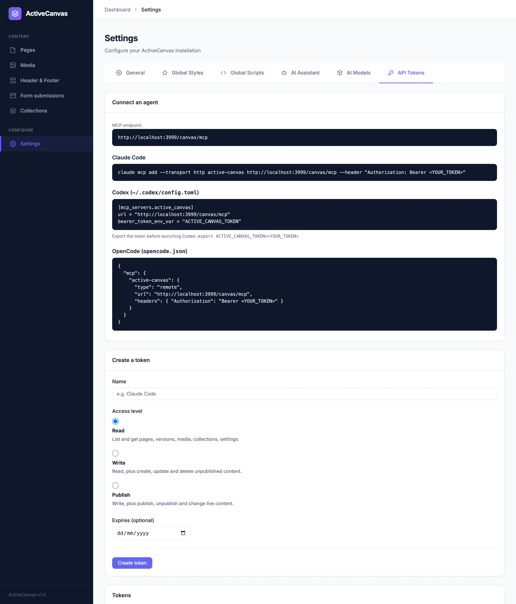
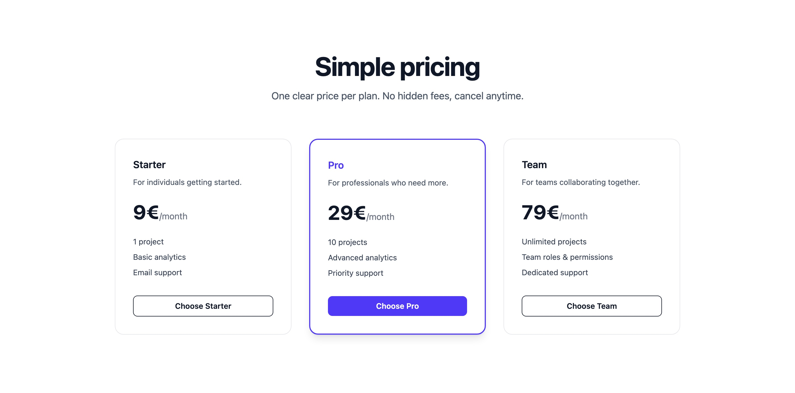
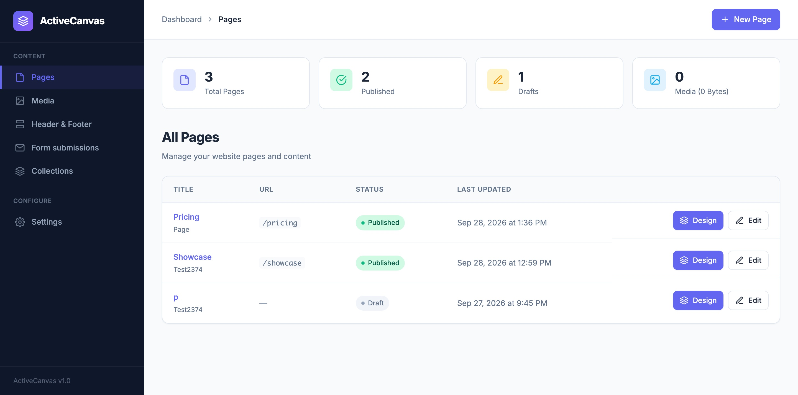
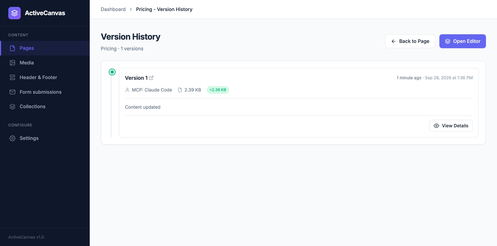
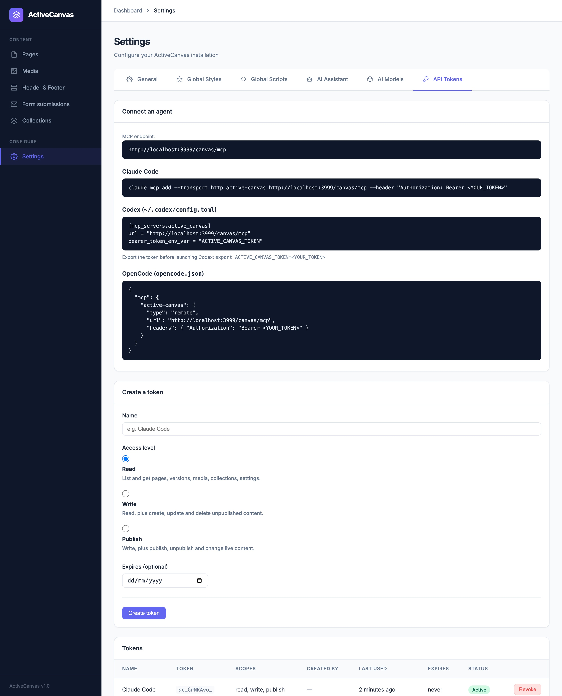

# Using ActiveCanvas from Claude Code

ActiveCanvas ships an MCP server inside the gem. Connect Claude Code (or Codex, OpenCode, any MCP client) to it and the agent can do everything the admin UI does: create and edit pages, manage collections, upload media, preview dynamic templates, publish.

This guide walks through a real session against the dummy app: create a token, connect Claude Code, then build and publish a pricing page with plain prompts.

## 1. Prerequisites

The MCP server needs the `active_canvas_api_tokens` table. After upgrading the gem, run:

```bash
bin/rails active_canvas:install:migrations
bin/rails db:migrate
```

The endpoint is enabled by default at `<engine mount path>/mcp`, for example `https://example.com/canvas/mcp`. To turn it off:

```ruby
# config/initializers/active_canvas.rb
ActiveCanvas.configure do |config|
  config.enable_mcp = false
end
```

## 2. Create an API token

In the admin, open **Settings → API Tokens**. The tab shows the MCP endpoint URL and ready-made connection snippets.



Give the token a name (it is used to sign the changes the agent makes), pick an access level and optionally an expiry date:

| Level | What the agent can do |
|---|---|
| **Read** | List and read everything: pages, versions, media, collections, form submissions, settings. Validate and preview templates. |
| **Write** | Read, plus create, update and delete **unpublished** content: draft pages, page types, collections, draft items, media, form submissions. Generate images. |
| **Publish** | Write, plus publish and unpublish, change anything that is **live** (published pages and items, header and footer), site settings (homepage, global CSS/JS, custom head, Tailwind) and AI settings. |

Start with **Write** if you want the agent to draft pages that you review and publish yourself.

After **Create token** the plaintext token is shown **once**. The snippets below it are filled in with it, ready to copy.


> The token in these screenshots belongs to a local demo install and has been revoked.

Only a SHA-256 digest of the token is stored. If you lose it, revoke it and create a new one.

## 3. Connect Claude Code

Copy the **Claude Code** snippet and run it in the project where you want to use it:

```
$ claude mcp add --transport http active-canvas http://localhost:3999/canvas/mcp --header "Authorization: Bearer ac_…"
Added HTTP MCP server active-canvas with URL: http://localhost:3999/canvas/mcp to local config
Headers: {
  "Authorization": "[REDACTED]"
}
```

By default the server is added to your **local** scope: private to you, only in the current project. Use `--scope user` to have it in every project, or `--scope project` to share it via `.mcp.json`. Don't commit a token in `.mcp.json`; use an environment variable instead.

Check the connection:

```
$ claude mcp list
Checking MCP server health…

active-canvas: http://localhost:3999/canvas/mcp (HTTP) - ✔ Connected
```

```
$ claude mcp get active-canvas
active-canvas:
  Scope: Local config (private to you in this project)
  Status: ✔ Connected
  Type: http
  URL: http://localhost:3999/canvas/mcp
  Headers:
    Authorization: Bearer ac_…

To remove this server, run: claude mcp remove active-canvas -s local
```

Inside an interactive `claude` session, `/mcp` shows the same server with its tools. The tool list depends on the token: a read-only token only exposes the read tools.

## 4. Work with prompts

From here you just ask. When the agent connects, the server tells it how ActiveCanvas works: the content model, image and form conventions, Liquid bindings, and the publish rule. You don't need to explain any of it in your prompts.

The examples below are real, unedited runs with `claude -p` (non-interactive). Interactive sessions work the same way; Claude Code asks for permission the first time each tool is used.

### List pages

```
$ claude -p "Using the active-canvas MCP server, list the pages of the site with title, slug and whether they are published. Answer as a short table." \
    --allowedTools "mcp__active-canvas__list_pages"

The site has 2 pages:

| Title | Slug | Published |
|---|---|---|
| p | *(none)* | No |
| Showcase | `showcase` | Yes |
```

### Create a draft page and check it

```
$ claude -p "Using the active-canvas MCP server, create a draft page titled 'Pricing' with slug 'pricing': a centered Tailwind hero with a heading 'Simple pricing' and a subtitle, and three pricing cards (Starter 9€, Pro 29€, Team 79€). Then render a preview to check it and tell me the page id and version number." \
    --allowedTools "mcp__active-canvas__create_page,mcp__active-canvas__render_page_preview,mcp__active-canvas__get_settings,mcp__active-canvas__list_page_types"

Created the Pricing page as a draft and verified the preview renders correctly.

- **Page ID:** 4
- **Version number:** 1
- **Status:** draft (not published)
- **Slug:** `pricing`, served at `/canvas/pricing` once published
- **Editor:** `/canvas/admin/pages/4/editor`

What the preview showed:
- A centered hero with the heading "Simple pricing" and the subtitle "One clear price per plan. No hidden fees, cancel anytime."
- Three pricing cards, side by side on medium screens and up, stacked on mobile:
  - **Starter:** 9€/month
  - **Pro:** 29€/month, highlighted with an indigo border, a shadow and a filled button
  - **Team:** 79€/month
- Each card has a short description, three feature bullets and a "Choose …" button.
- All the Tailwind classes were compiled into the page CSS, so nothing will render unstyled.

Before publishing, a few things to check:
- The feature lists and descriptions are placeholder copy I wrote.
- The buttons link to `#` for now.
- The page has the site header and footer turned on, but nothing appeared in the preview. They're probably empty right now.

When you're ready, publishing is done with `set_page_published` (needs the `publish` scope).
```

The agent checked the CSS framework with `get_settings`, created the page with `create_page` (always as a draft), and verified its own work with `render_page_preview` before answering.

### Publish

```
$ claude -p "Using the active-canvas MCP server, publish the Pricing page." \
    --allowedTools "mcp__active-canvas__list_pages,mcp__active-canvas__set_page_published"

The Pricing page (id 4) is now published at `/canvas/pricing`, and the server confirmed `published: true`. It shows three plans: Starter at 9€/month, Pro at 29€/month and Team at 79€/month.

The three "Choose …" buttons are placeholders (`href="#"`), so clicking them does nothing. You'll want to point them at your signup or checkout URLs.
```

This needs a token with the **Publish** level. With a Write token the tool isn't offered at all, and changing an already published page fails with:
`This page is published; changing it requires the 'publish' scope.`

## 5. The result

The page is live:



It shows up in the admin like any other page, and it opens in the visual editor:



Every content change made through MCP creates a page version, signed with the token name (`MCP: <token name>`). You can see who changed what, and undo it from the admin or by asking the agent to "restore version N" (`restore_page_version`):



Back in **Settings → API Tokens**, the token shows its scopes, when it was last used and a **Revoke** button:



## 6. More prompts to try

- *"Upload `./assets/team.jpg` to ActiveCanvas and put it at the top of the About page."* The agent uses `upload_media` and inserts ``.
- *"Create a Testimonials collection with name, quote and photo fields, add three draft items, and show them on the home page in a loop."* This uses the collection tools, `list_data_sources`, `sample_binding_data`, `validate_template` and `update_page_content` with `template_enabled`.
- *"Export this week's contact form submissions as CSV."* This uses `export_form_submissions_csv`.
- *"Change the brand color in the Tailwind config to #4f46e5 and recompile."* This uses `update_site_settings` and `recompile_tailwind` (Publish level).
- *"Something broke on the Pricing page. Show me the last three versions and restore the previous one."* This uses `list_page_versions`, `get_page_version` and `restore_page_version`.

Header and footer changes (`update_partial`) go live immediately and are **not** versioned, so review those carefully.

## 7. Other clients

The same tab has snippets for the other clients:

**Codex** (`~/.codex/config.toml`):

```toml
[mcp_servers.active_canvas]
url = "https://example.com/canvas/mcp"
bearer_token_env_var = "ACTIVE_CANVAS_TOKEN"
```

Then run `export ACTIVE_CANVAS_TOKEN=ac_…` before starting Codex.

**OpenCode** (`opencode.json`):

```json
{
  "mcp": {
    "active-canvas": {
      "type": "remote",
      "url": "https://example.com/canvas/mcp",
      "headers": { "Authorization": "Bearer ac_…" }
    }
  }
}
```

## Troubleshooting

| Symptom | Cause |
|---|---|
| `claude mcp list` shows the server as failed, HTTP 401 | The token is wrong, revoked or expired. Create a new one. |
| HTTP 404 on `/mcp` | `config.enable_mcp` is `false`, or the URL is missing the engine mount path (e.g. `/canvas`). |
| HTTP 429 | The per-token rate limit was hit (`config.mcp_rate_limit_per_minute`, default 120). |
| A tool you expect is missing | The token's level doesn't include it. Mutating tools need Write, publishing and live changes need Publish. |
| "requires the 'publish' scope" | The record is published. Use a Publish token, or unpublish it first from the admin. |
| Error 500 / missing table | The migrations were not run (step 1). |
| A page with slug `mcp` isn't reachable | The MCP endpoint takes that path. Rename the page. |

To disconnect: `claude mcp remove active-canvas`, then revoke the token in **Settings → API Tokens**.
